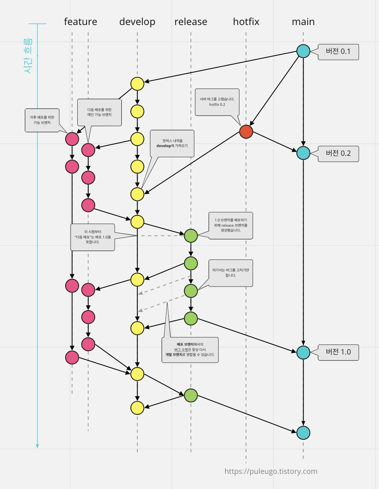

# 25-2-CAU-ObjectOrientedProgramming
2025년 2학기 중앙대학교 객체지향프로그래밍(49156-2)

## Team 7
- 류승우(조장) / 20225048
- 류지헌 / 20222420
- 원지환 / 20220054
- 박동희 / 20224987
- 박해용 / 20225290

------
## Commit Rule
**일반적인 형태 (세부사항은 프로젝트마다 다름)**

이대로 하기에는 너무 어려우니까,, 간단하게만 도전

### 0. "main" branch
- 완성된 프로그램, 배포용 프로그램
- 모든 작업이 끝난 후 "dev"에서 merge

### 1. "dev" branch
- 개발 브랜치
- "main" 에서 branch
- 개발한 기능(feature 브랜치)을 merge하기
- 의도대로 작동하는지 테스트

### 2. "feature" branch
- 기능 구현 브랜치
- "dev" 에서 branch
- 일반적으로, "feature */ name* " 의 형태로 만듬
- *name* 에 해당하는 기능을 개발하는 브랜치

------
## 결론
1. 우선 dev branch에서 feature branch 생성하기
2. 맡은 기능 구현하기
3. dev에 merge하기

## 참고사항 & 주의사항
### 1. Commit은 작은 단위별로 하기!
- Commit 메시지를 잘 써놓으면 좋음 (e.g. xxx 기능 구현, yyy 수정)
### 2. 타인의 코드 수정금지
- 필요한 경우 상대방과 의사소통하기
- Interface를 미리 정해놓는게 좋음
### 3. 적절한 주석이 있으면 좋음
- "직관적이고 이해하기 좋은 코드를 짜라" 라고는 하는데
- 사실 말이 쉽지,,,,,,
- 최소한 메서드의 Argument / Return 정도는 달아두는 게 좋은 듯함
- 복잡한 로직이 있는 경우 달아주면 좋을 듯함 (보고서 써야해서)